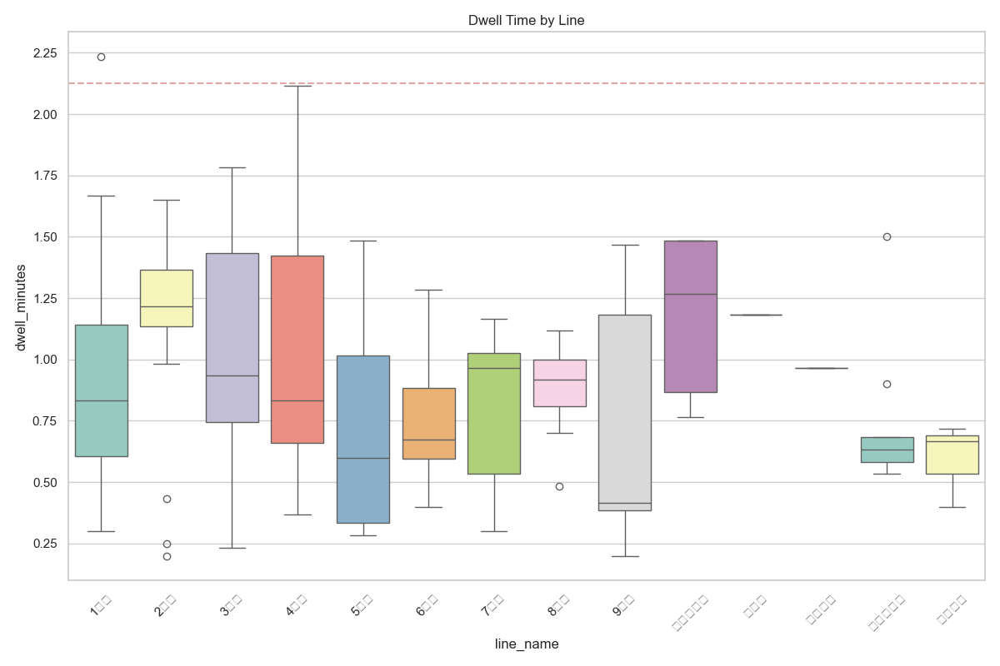

# 🚇 실시간 열차 지연 분석 보고서

**분석 일시**: 2026-01-07 16:04:12

## 1. 요약 통계 (Summary Statistics)
- **총 분석 대상 정차 횟수**: 170건
- **평균 체류 시간**: 0.90분
- **지연 임계값 (IQR Threshold)**: 2.12분 (이 시간 이상 정차 시 지연으로 간주)
- **탐지된 지연 횟수**: 1건

## 2. 시각화 (Visualization)
### (1) 전체 체류 시간 분포
대부분의 열차가 얼마나 역에 머무르는지 보여줍니다. 오른쪽 꼬리가 길수록 지연이 많음을 의미합니다.

### (2) 호선별 지연 패턴 비교
어떤 호선이 상대적으로 정차 시간이 긴지 비교합니다.

## 3. 주요 지연 발생 구간 (Top 10 Delay Hotspots)
| 순위 | 호선 | 역명 | 열차번호 | 체류시간(분) | 상태 |
|:---:|:---:|:---:|:---:|:---:|:---:|
| 1 | 1호선 | 종각 | 0129 | **2.23** | 1 |
